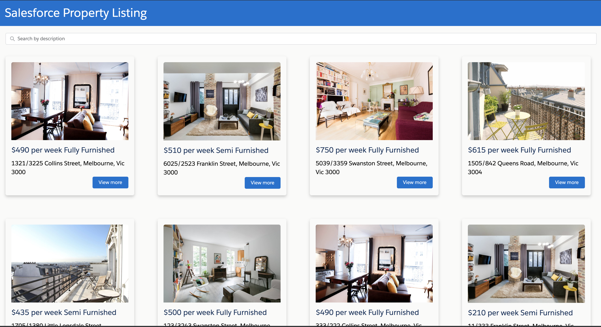
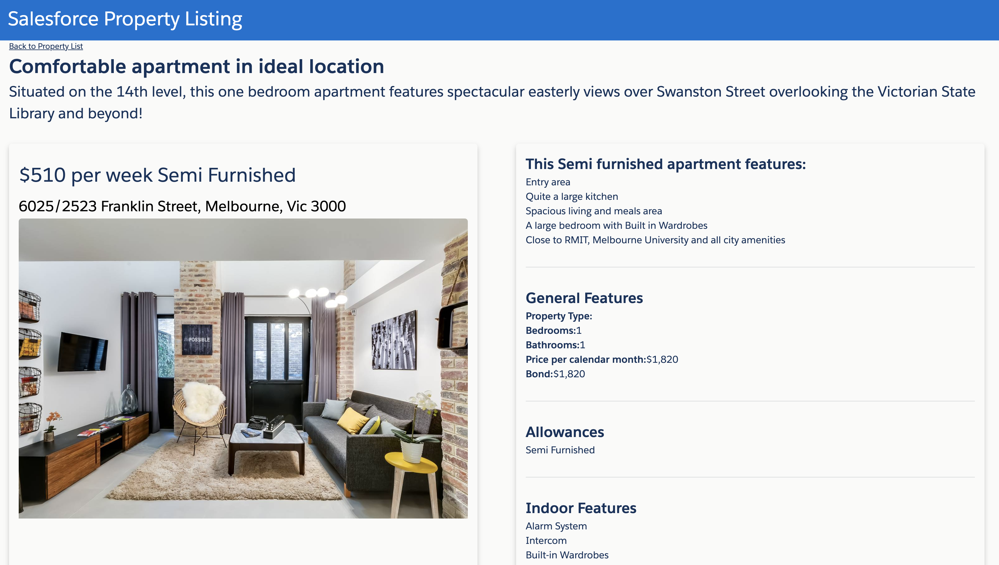

#  Salesforce Property Listing
### Basic Demo to demostrate the functionalities of Lightning web components
* Setup of SDFX in vscode
* LWC setup
* Adding LWC to Aura component
* Filtering
* Using lightining design system components
* Passing data between different components
* using Data import
* Two way data binding

## Final result

